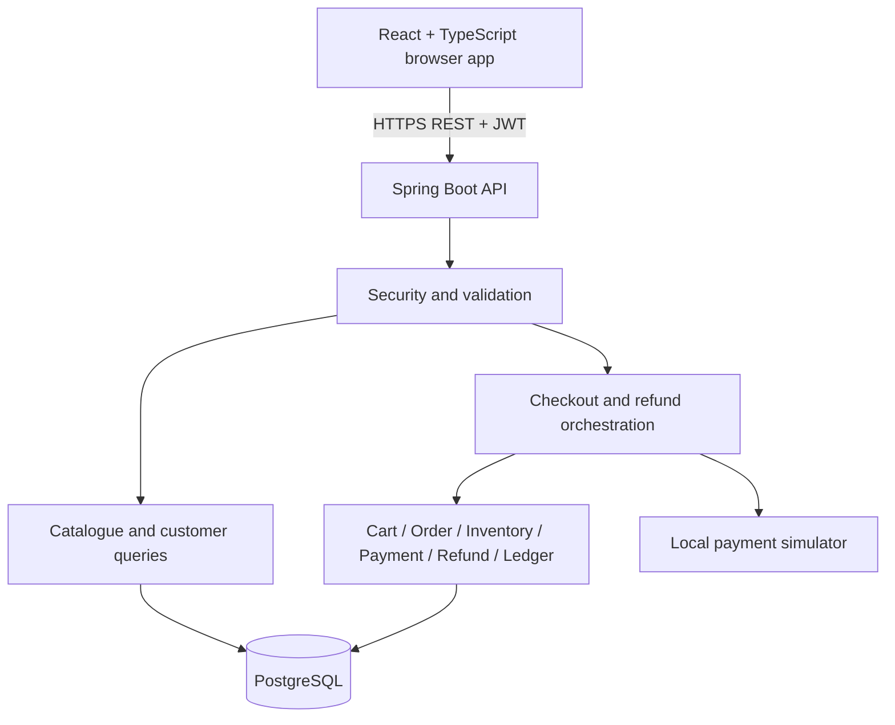
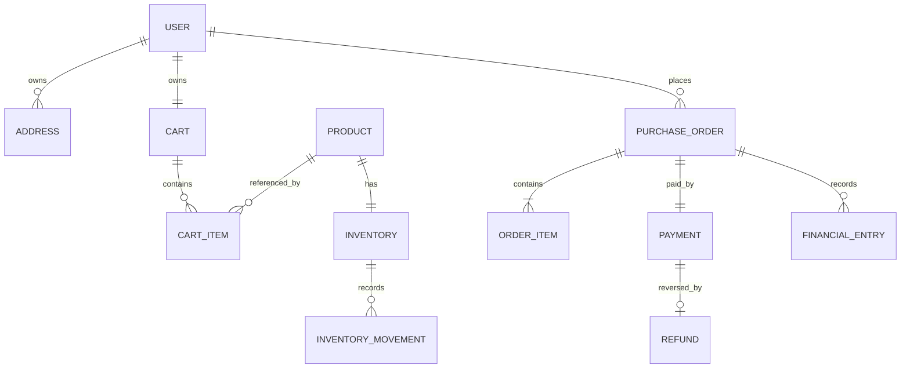
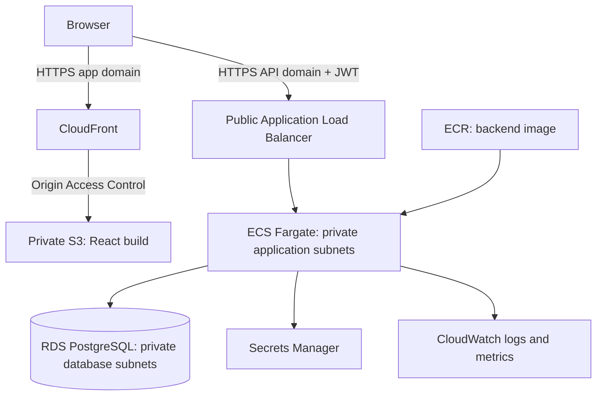

# NexusCommerce V1 — System Design

**Status:** Proposed implementation baseline  
**Date:** 19 September 2026  
**Source:** NexusCommerce conversation and its Phase 1 PRD  
**Stack:** React, TypeScript, Spring Boot, PostgreSQL, JWT, Flyway, Docker, AWS

## 1. Purpose and goals

NexusCommerce V1 is a complete shopping application built to demonstrate reliable transaction processing. A customer can browse products, maintain a cart, buy products using simulated payment, view orders and financial history, and cancel or refund an eligible purchase. An administrator manages products and inventory and reviews commerce activity.

The central rule is simple: an operation must leave the database in a valid state, including when requests arrive together or a process crashes.

V1 must ensure:

- Stock never becomes negative.
- A confirmed order has exactly one successful simulated payment for its total.
- Repeating a checkout does not create another purchase.
- A payment cannot be refunded for more than its original amount.
- Cancelling or refunding a purchase restores inventory only once.
- Historical prices and financial records remain auditable.
- Customers can access only their own private data.

## 2. Non-goals

V1 explicitly excludes AI, RAG, agents, Kafka, microservices, Kubernetes, Saga, distributed transactions, and event-driven infrastructure. It also excludes real payment gateways, banking or UPI integration, real shipping, multi-vendor selling, coupons, loyalty programs, advanced taxes, multiple currencies, mobile applications, and multi-region deployment.

All commerce writes use one PostgreSQL database. Backend modules are ordinary in-process components in one deployable application.

## 3. Requirements and design decisions

| Area | V1 requirement |
|---|---|
| Identity | Registration, login, JWT authentication, USER and ADMIN roles |
| Catalogue | Active product listing, name search, category filter, product details |
| Cart | Add, change quantity, remove; a cart does not reserve stock |
| Checkout | Validate current data, calculate totals on the server, purchase atomically |
| Payments | Local, synchronous simulator with success and decline outcomes |
| Orders | Immutable item and address snapshots; customer and admin views |
| Cancellation/refunds | Full-order operations; atomic refund and stock restoration |
| History | Append-only financial entries and inventory movements |
| Operations | Versioned migrations, structured logs, automated tests, AWS deployment |

The PRD deliberately leaves some implementation choices open. This document resolves them as follows:

1. **Single currency:** INR initially; store money as integer paise in a `BIGINT`, never floating-point values. ₹499.00 is `49900`. Reject arithmetic overflow and impose price and quantity limits.
2. **Synchronous payment:** `PENDING` is an internal state within a request. There are no committed purchases awaiting payment, payment polling, or stock reservations in V1. Delayed payment is a future scope change.
3. **Full refunds only:** No partial refunds or individual item returns. A confirmed order is eligible because V1 has no shipping or fulfillment stage.
4. **Paid cancellation:** Cancelling a confirmed order performs a full simulated refund. Its final order status is `CANCELLED`, and payment status is `REFUNDED`. A direct refund request ends with order status `REFUNDED`.
5. **Immediate processing:** Customer refund requests are evaluated and processed immediately; admin approval is not part of V1.
6. **Declines:** Expected simulator declines are decided before commerce mutations. Save the failed attempt and idempotent response, without creating an order or changing stock. Unexpected errors after mutations roll back the entire transaction.
7. **No persistent failed orders:** Failed attempts appear in operation history, not as purchased orders. The PRD's `FAILED` order enum is retained as a reserved concept, not an externally reachable V1 order state.

These are proposed product decisions, not claims that every detail was fixed in the original conversation.

### Development performance targets

Use the PRD targets as initial p95 goals: product listing below 500 ms, ordinary API calls below one second, checkout below two seconds. Measure with a seeded dataset of 10,000 products and 50 concurrent users; report hardware, request mix, and database size. These are test targets, not production SLAs. Simulated delay tests are separate and must not sleep while holding database locks.

## 4. Application architecture



React uses routes for catalogue, cart, checkout, orders, transaction history, and admin pages. A server-state library such as TanStack Query handles loading, errors, and query invalidation. Forms validate for usability; the backend repeats every important check. API DTOs are separate from persistence entities.

The backend follows `controller → application service → domain rules/repository`. The application service owns the transaction boundary. One database connection and transaction manager cover all participating modules.

The simulator is a local function, with no HTTP calls and no real charge. This is why a successful payment record can participate in the same ACID transaction as inventory and orders. A database rollback cannot undo a real external payment; this design must change before introducing one.

## 5. Module boundaries

| Module | Owns | Public capabilities |
|---|---|---|
| auth | Password verification, JWT issuance and validation | Register, authenticate, authorize |
| user | Profiles and addresses | Read owner profile, validate address ownership |
| product | Catalogue, SKU, price, active status | Search products, obtain locked purchase snapshot, admin edits |
| inventory | Stock and inventory movement history | Deduct, restore, adjust stock |
| cart | Cart, items, cart version | Change cart, lock purchase snapshot, clear purchased cart |
| order | Orders, item snapshots, order transitions | Create purchase, read order, enforce lifecycle |
| payment | Payment records and simulator adapter | Simulate charge/refund, record payment state |
| refund | Refund records and eligibility rules | Validate and record full refund |
| transaction | Financial entries | Append successful operation, query history |
| checkout | Cross-module checkout workflow | Execute one atomic checkout |
| commerce operations | Cancellation/refund workflow and operation attempts | Execute atomic reversal |
| shared infrastructure | Idempotency, errors, clock, IDs, observability | Technical support only |

Each module owns its repositories. Other modules call its service interface instead of writing its tables or importing its repository. Cross-module foreign keys are allowed because this is one database. Avoid bidirectional JPA object graphs between modules; use IDs and explicit DTOs.

Orchestrators call modules; modules do not call back into orchestrators. Use package dependency tests to enforce this direction. Read-only admin views may use dedicated projection queries, but may not become alternative write paths.

## 6. Domain model and storage



### Key entities

All primary identifiers are UUIDs. Use UTC `TIMESTAMPTZ` for timestamps, explicit foreign keys, and constrained string statuses. Avoid table names such as `user`, `order`, and `transaction`; use `app_user`, `purchase_order`, and `financial_entry`.

| Entity | Important fields and constraints |
|---|---|
| User | `id`, normalized email UNIQUE, password hash, name, role, enabled, timestamps |
| Address | `id`, `user_id`, recipient and address fields; private customer data |
| Product | `id`, SKU UNIQUE, name, description, category, image key/URL, `price_minor > 0`, currency, active, version |
| Inventory | `product_id` PK/FK, `available_quantity >= 0`, version, updated time |
| Cart | `id`, `user_id` UNIQUE, version, updated time |
| CartItem | `id`, `cart_id`, `product_id`, positive quantity; UNIQUE(cart, product) |
| Order | `id`, user, source cart ID/version, total, currency, status, address snapshot, created time; UNIQUE(source cart ID, source cart version) |
| OrderItem | order, product ID, SKU/name/unit-price snapshots, quantity, line total |
| Payment | `id`, `order_id` UNIQUE, amount, currency, method=`SIMULATED`, status, created time |
| Refund | `id`, `payment_id` UNIQUE, order ID, full amount, status, reason, kind=`CANCEL` or `REFUND`, timestamps |
| FinancialEntry | `id`, order/payment/refund references, type, positive amount, currency, status=`SUCCESS`, operation ID, created time |
| InventoryMovement | product, signed quantity delta, reason, order or adjustment ID, actor, timestamp |
| OperationAttempt | actor, operation type, target/reference, outcome, safe reason code, timestamp; no card data |
| IdempotencyRecord | actor, operation scope, key, request hash, HTTP status, response JSON, resource ID, timestamps; UNIQUE(actor, scope, key) |

Enforce one PAYMENT financial entry per payment and one REFUND entry per refund using partial unique indexes. Enforce one sale and one restoration movement per order/product, grouping any duplicate product lines before writing. Admin stock changes also have a unique adjustment ID.

For a full refund, the service checks under the payment lock that the amount equals the original payment and that currency matches. A unique `refund.payment_id` prevents another full refund even under a different idempotency key. Cross-row sums and state relationships require transactional service rules and reconciliation; a simple SQL `CHECK` cannot enforce every relationship.

Financial entries are a simple append-only operation journal, not a double-entry accounting system. PAYMENT contributes a positive amount and REFUND subtracts that amount when calculating net receipts. A refund appends an entry; it never rewrites the original payment entry. Give the runtime database role no update/delete permission on journal tables; migrations use a separate role.

Failed attempts are not successful money movements. Store them in `operation_attempt`, and combine them with successful entries for customer/admin transaction-history views using explicit record types.

### Indexes and retention

- Index active catalogue filters and user-order history `(user_id, created_at, id)`.
- Index financial and attempt history by owner/target and timestamp; index foreign keys used in joins.
- Index admin order/refund lists by status and creation time.
- Start with basic PostgreSQL name search; add a measured search index when necessary.
- Keep orders, ledger entries, movements, and V1 idempotency records for the lifetime of the demo dataset. Do not silently expire keys and then reuse them.
- Deactivate products instead of deleting records referenced by purchases. Keep address snapshots on orders even if a saved address changes.

## 7. REST API surface

All routes start with `/api/v1`. Lists are paginated with a bounded page size and stable sort order. DTO amounts use minor units and an explicit currency. Generate an OpenAPI specification alongside implementation.

| Method and path | Access | Purpose |
|---|---|---|
| POST `/auth/register` | Public | Create customer account; role is always USER |
| POST `/auth/login` | Public | Issue short-lived JWT |
| GET `/me` | Signed in | Current profile |
| GET/POST `/addresses` | Owner | List/create saved addresses |
| PATCH/DELETE `/addresses/{id}` | Owner | Modify/delete owned address |
| GET `/products` | Public | Search, filter, paginate active products |
| GET `/products/{id}` | Public | Active product details |
| GET `/cart` | Owner | Items, current prices, version |
| PUT `/cart/items/{productId}` | Owner | Set absolute quantity; expected cart version required |
| DELETE `/cart/items/{productId}` | Owner | Remove item; expected cart version required |
| POST `/orders/checkout` | Owner | Atomic purchase; idempotency key required |
| GET `/orders`, `/orders/{id}` | Owner | Purchase history/detail |
| POST `/orders/{id}/cancel` | Owner | Cancel and fully refund; key required |
| POST `/orders/{id}/refunds` | Owner | Full refund and stock restoration; key required |
| GET `/transactions` | Owner | Successful financial entries and clearly marked failed attempts |
| POST `/admin/products` | ADMIN | Create product and initial inventory |
| PATCH `/admin/products/{id}` | ADMIN | Edit/deactivate using expected version |
| POST `/admin/inventory/{productId}/adjustments` | ADMIN | Apply signed stock delta with key and reason |
| GET `/admin/orders`, `/admin/payments` | ADMIN | Review purchases and payments |
| GET `/admin/transactions`, `/admin/refunds` | ADMIN | Review financial history and refunds |

No endpoint can arbitrarily set order/payment/refund status. Status changes happen through business commands.

Example checkout:

```http
POST /api/v1/orders/checkout
Authorization: Bearer <access-token>
Idempotency-Key: 47c8b33b-6e64-46fb-88b4-922293d9a333
Content-Type: application/json

{"cartId":"<uuid>","cartVersion":7,"addressId":"<uuid>","expectedTotalMinor":99800,"currency":"INR","paymentMethod":"SIMULATED"}
```

The server recalculates the total. `expectedTotalMinor` only protects the customer from buying at an unexpectedly changed price. A mismatch returns `409 PRICE_CHANGED` and requires review and a new attempt.

```json
{"orderId":"<uuid>","orderStatus":"CONFIRMED","paymentStatus":"SUCCESS","totalMinor":99800,"currency":"INR"}
```

Return `201` on checkout success and the same stored status/body on replay. Return `200` for successful cancellation/refund. The frontend keeps the same key and request body after network timeouts; a deliberate new attempt gets a new key. Preserve unresolved attempt metadata across reloads, without storing JWTs or private address contents there.

## 8. Atomic checkout design

Use PostgreSQL `READ COMMITTED` isolation with explicit row locks. The application service is a public transactional bean invoked through Spring's proxy. Configure rollback for checked business exceptions where necessary, for example `@Transactional(rollbackFor = Exception.class)`. Internal self-calls do not activate proxy transactions. [Spring transaction annotations](https://docs.spring.io/spring/reference/6.2/data-access/transaction/declarative/annotations.html)

### Transaction steps

1. Authenticate and validate request shape before starting database work.
2. Begin one transaction and claim the idempotency key. Replay an existing completed result before checking the current cart.
3. Lock the cart row and verify ownership and requested version. All cart mutations must lock this same parent row.
4. Read the owned address into an immutable order snapshot. Lock product rows in ascending product ID order, then inventory rows in the same order.
5. Validate active products, quantities, sufficient stock, currency, current prices, and expected total. Calculate the order total on the server.
6. Ask the local simulator for a deterministic result for this logical attempt. It must not make network calls, sleep, or change external state.
7. On an expected validation failure or decline, write a failed operation attempt and final idempotency response, then commit those records only. There are no commerce writes to undo at this point.
8. On success, create order/item/address snapshots, deduct stock, append sale movements, create successful payment and PAYMENT journal entry, and set the order to `CONFIRMED`.
9. Clear purchased cart items and increment the cart version. Write the completed idempotency response.
10. Commit. Only then return success to the browser.

An exception during steps 8–10 rolls back the order, payment, journal, stock changes, cart changes, and idempotency claim together. Never catch a database error inside a rollback-only transaction and then pretend to commit a response.

Rollback rules must be explicit: Spring ordinarily rolls back on unchecked exceptions, so relying on all checked exceptions to roll back is unsafe. [Spring declarative transaction management](https://docs.spring.io/spring-framework/reference/7.1/data-access/transaction/declarative.html)

### Practical examples

**Final unit:** Stock is 1. Customer A locks the inventory row. Customer B waits. A commits a purchase and stock becomes 0. B acquires the lock, sees 0, and receives `OUT_OF_STOCK` without a payment or order.

**Crash before commit:** The process dies after inserting the payment but before commit. PostgreSQL rolls back the uncommitted transaction. The same key can safely retry.

**Response lost after commit:** The purchase exists but the browser times out. Retrying the same key returns the stored result without buying again. Do not generate a new key merely because the browser did not receive a response.

### ACID mapping

| Property | What it means here |
|---|---|
| Atomicity | Purchase writes commit together or all roll back |
| Consistency | Constraints and business rules preserve stock, totals, and valid states |
| Isolation | Locks serialize conflicting stock and lifecycle changes |
| Durability | Committed state survives application restarts; database backup/recovery protects against larger failures |

## 9. Concurrency strategy

Use pessimistic row locking for hot commerce records and optimistic versions for stale user/admin edits. PostgreSQL row locks are held until transaction end, and deadlocks remain possible. Consistent lock ordering reduces the risk. [PostgreSQL explicit locking](https://www.postgresql.org/docs/17/explicit-locking.html)

Adopt this global lock order when the rows apply: idempotency claim → cart → existing order → existing payment/refund → products sorted by ID → inventory sorted by product ID. No workflow may lock an earlier category after a later category. New private order/payment rows inserted by checkout cannot contend with other requests before commit.

- Checkout locks product rows so price changes and deactivation cannot race with the purchase snapshot.
- Cart changes lock the cart parent, compare version, change items, then increment version.
- Cancellation/refund locks the existing order and payment before inventory.
- Admin inventory adjustments lock inventory and apply a delta, never overwrite stock based on a previously read value.
- Admin product updates check an optimistic version and cooperate with product row locks.
- An inventory version supports stale-edit detection and diagnostics; database locks are the purchase serialization mechanism.

Even under a lock, use guarded updates such as `UPDATE inventory SET available_quantity = available_quantity - :qty WHERE product_id = :id AND available_quantity >= :qty`, and require one affected row. Keep a database non-negative constraint as a final defense.

Set bounded database lock and statement timeouts. Retry an aborted deadlock/serialization transaction at most twice with jitter, starting a fresh transaction each time. Use the original idempotency key. Do not retry declines, invalid state, or insufficient stock automatically. Treat uncertain commit outcomes as an idempotency lookup/retry problem.

Do not use Java `synchronized` for database correctness: two ECS instances do not share that lock.

## 10. Idempotency design

Idempotency means that the same logical request has one stored outcome even when delivered multiple times.

The database unique key is `(authenticated_actor_id, operation_scope, idempotency_key)`. Example scopes are `CHECKOUT`, `CANCEL:<orderId>`, and `REFUND:<orderId>`. Keys must be bounded strings; clients normally generate UUIDs.

Hash a canonical representation of the method, target, API version, and request payload. For checkout it includes cart ID/version, address ID, expected total, currency, and payment method. Do not hash mutable current database values; otherwise a legitimate replay after checkout would no longer match.

Within the commerce transaction:

1. Try `INSERT ... ON CONFLICT DO NOTHING` for the claim.
2. A concurrent request with the same unique key waits for the first transaction, subject to a timeout.
3. If the first commits, read its record with a fresh statement. Matching hash returns the stored response; different hash returns `409 IDEMPOTENCY_KEY_REUSED`.
4. If the first rolls back, the waiting request can acquire the claim and execute normally.
5. Complete the response record before commit. Never commit an unfinished claim in this design.

Authentication and ownership checks still apply on replay. A stored response contains only the fields needed for recovery. An in-flight timeout returns a retryable error and `Retry-After`; the client retries the same key.

Separate keys are not the same operation. Therefore add business uniqueness too: one order per cart version, one payment per order, one full refund per payment, and one stock restoration per order/product. Two browser tabs using different checkout keys cannot purchase the same cart version twice.

## 11. Order, payment, and refund state machines

State transitions are service methods, not editable fields.

### Order

```text
PENDING → PAYMENT_PENDING → CONFIRMED
                              ├─ cancellation + successful full refund → CANCELLED
                              └─ direct successful full refund         → REFUNDED
```

`PENDING` and `PAYMENT_PENDING` are transient within successful checkout. External clients see `CONFIRMED` after commit. A failed checkout creates an operation attempt and no order. `CANCELLED` and `REFUNDED` are terminal. V1 does not expose a durable `FAILED` order despite its inclusion in the PRD's initial enum list.

### Payment

```text
PENDING → SUCCESS → REFUNDED
```

Payment `PENDING` is transient. A simulator decline is a failed attempt, not a committed payment against a nonexistent order. If persistent `FAILED` payments become a requirement, introduce a separate pre-payment order lifecycle deliberately.

### Refund

```text
PENDING → SUCCESS
```

Refund `PENDING` is transient. A failed simulator result records a failed attempt; the order and payment remain unchanged, and no completed refund exists. `FAILED` is an attempt outcome rather than a durable refund entity state in this baseline.

### Allowed persisted combinations

| Order | Payment | Refund | Inventory effect |
|---|---|---|---|
| CONFIRMED | SUCCESS | None | Deducted once |
| CANCELLED | REFUNDED | SUCCESS, kind CANCEL | Restored once |
| REFUNDED | REFUNDED | SUCCESS, kind REFUND | Restored once |

For example, `CANCELLED + SUCCESS payment + no refund` must never commit. The order retains the customer's action while the payment records the money result.

## 12. Cancellation and refund transaction

Both endpoints call one reversal workflow with a different reason/kind:

1. Claim/replay idempotency inside a transaction.
2. Lock the order, then its payment. Check ownership and `CONFIRMED + SUCCESS`.
3. Check that no successful refund exists and that the requested reversal is for the full original amount. The backend supplies that amount; customers cannot override it.
4. Lock all relevant inventory rows in ascending product ID order.
5. Run the local refund simulator before making commerce changes. A decline records the failed attempt and response only, leaving the purchase intact.
6. Insert the successful refund and REFUND financial entry. Restore each purchased quantity and append unique restoration movements.
7. Set payment to `REFUNDED`; set order to `CANCELLED` or `REFUNDED`. Store the response and commit.

If any write fails, all reversal changes roll back. A different key against an already reversed order returns `409 ORDER_ALREADY_REVERSED` with the existing reversal reference. A replay of the original key returns its original success.

**Example:** An order purchased two keyboards. Cancellation restores two keyboards. Ten retries restore zero additional keyboards. A simultaneous direct refund cannot create a second reversal because both requests must lock the same order/payment, and database uniqueness provides a second defense.

## 13. Security

- Hash passwords with BCrypt using a work factor measured on deployment hardware. Never store plaintext passwords or log credentials.
- Issue short-lived signed access JWTs, initially 15 minutes. Validate signature, allowed algorithm, issuer, audience, and expiry. Store signing material in Secrets Manager and support key rotation.
- Keep access tokens in browser memory and send them in the Authorization header. V1 requires login again after expiry or reload; refresh tokens are a separate scope decision. Logout clears the token, but an already issued token remains valid until expiry unless the account is disabled.
- Check account enabled status and current role on protected requests so disabling a user or removing admin access takes effect promptly.
- Restrict CORS to the deployed frontend origin. With header-only authentication and no authentication cookies, cross-site cookie authentication is absent; revisit CSRF protection if cookies are introduced.
- Check object ownership in every private read/write query, including idempotency replay. UUIDs do not replace authorization. Return 404 for another customer's resource.
- Do not accept role or user ID from registration/checkout bodies as authority. Provision the first admin through a controlled operator process.
- Use Bean Validation, parameterized queries, bounded input sizes, and escaped frontend rendering. Add a content security policy and avoid rendering unsanitized HTML.
- Rate-limit login and expensive endpoints at a shared ingress layer or shared database-backed mechanism; per-process limits alone are not global across replicas.
- Enable HTTPS, encrypted RDS storage/backups, restricted security groups, and least-privilege IAM/database roles.
- Never collect real card or bank details. Simulator scenario overrides belong to test/admin-controlled configuration, not unrestricted customer input.

## 14. Error handling and recovery

Use one error response format:

```json
{"code":"OUT_OF_STOCK","message":"Only 1 unit is available.","correlationId":"<uuid>","retryable":false,"details":{"productId":"<uuid>","availableQuantity":1}}
```

| HTTP status | Example | Client behavior |
|---|---|---|
| 400 | Invalid quantity or missing key | Correct request |
| 401 | Expired/invalid JWT | Log in again, then resume with original operation key |
| 403 | Admin permission missing | Show access denied |
| 404 | Missing or unowned resource | Show not found |
| 409 | Stock, cart version, price, state, or key conflict | Refresh relevant data; review before a new attempt |
| 422 | Simulated payment/refund declined | Show decline; deliberate retry uses a new key |
| 429 | Rate limited | Respect Retry-After |
| 503 | Database unavailable or lock wait exhausted | Retry with backoff and the same key |
| 500 | Unexpected application failure | Show safe error; preserve attempt key for recovery |

Never expose stack traces, SQL, secrets, or internal hostnames. Return success only after commit. A network timeout is an unknown outcome, not proof of failure.

Expected business failures can be stored with their idempotency response. Unexpected failures that roll back leave no durable business attempt record; structured error logs provide diagnostics. Do not try to write an audit row into the same transaction after it has failed.

## 15. Observability and reconciliation

Send structured JSON logs to CloudWatch. Include correlation ID, route, duration, safe user ID, order/refund ID when present, outcome, and error code. Log an idempotency key hash instead of full payloads. Exclude passwords, JWTs, address text, and secrets.

Track request volume, p95/p99 latency, error rate, checkout outcomes, refund failures, idempotency replays/conflicts, lock timeouts, deadlocks, connection-pool saturation, ECS restarts, and RDS CPU/storage/connections.

Expose minimal health endpoints: liveness checks that the process is alive; readiness verifies it can serve requests and reach the database. Keep detailed Actuator endpoints private. Configure alarms for sustained error rate, failed readiness, storage pressure, and any reconciliation mismatch. Tune thresholds after load testing.

Run a daily read-only reconciliation report using SQL or an operator command:

- Confirmed orders have one matching successful payment and PAYMENT entry.
- Cancelled/refunded orders have one successful full refund and REFUND entry.
- Order totals match item snapshots; payment/refund amounts and currency agree.
- Stock is non-negative and matches opening balance plus movement history.
- Each reversed order has exactly one restoration per purchased product.

Report mismatches for investigation; do not silently repair financial history.

## 16. Testing strategy

| Layer | Important tests |
|---|---|
| Unit | Money arithmetic, eligibility, allowed transitions, total calculation, request hashing |
| PostgreSQL integration | Constraints, row locks, rollback, uniqueness, Flyway migrations |
| API/security | JWT validation, role checks, ownership, validation and consistent errors |
| Frontend | Cart changes, price conflicts, decline display, timeout retry with same key |
| End-to-end | Register → cart → checkout → history → cancel/refund |
| Load/failure | Contended stock, lock waits, connection pressure, process termination |

Use JUnit, Spring Boot Test, and Testcontainers with real PostgreSQL behavior. H2 is not an adequate substitute for transaction and locking acceptance tests. Run concurrent requests on separate connections with synchronization barriers, not an enclosing test transaction that hides commit behavior.

Required acceptance scenarios:

1. Stock 1, 20 buyers: exactly one successful purchase, stock 0, one payment and one PAYMENT entry.
2. Same checkout key sent concurrently: one order/payment; all completed replays agree.
3. Different checkout keys for the same cart version: one purchase.
4. Reused key with changed payload: conflict and no side effect.
5. Crash/fault after each purchase write before commit: no partial purchase and unchanged cart/stock.
6. Lost response after commit: replay recovers the original order.
7. Concurrent cancel and refund with different keys: one refund, one stock restoration.
8. Refund decline or injected failure: original purchase remains intact; no partial refund.
9. Admin adjustment versus purchase: correct final stock and complete movement history.
10. Product price/deactivation or cart edit versus checkout: no mixed snapshot or lost cart edit.
11. Customer A requests customer B's order, address, or transaction: denied.
12. Clean database migration and upgrade from the previous schema both pass; restore a backup into a test environment and reconcile.

Release only when the invariants hold under concurrency, not merely when HTTP responses look correct.

## 17. Local development and migrations

Use Docker Compose for PostgreSQL and the backend, with React either in a development container or local development server. Keep sample data synthetic. Check in environment-variable names and examples, never real secrets.

Flyway owns schema changes. Use versioned migration scripts and Hibernate schema validation rather than automatic schema updates. Once a migration has shipped, add a new migration instead of editing its contents.

Use the same PostgreSQL major version across local, test, and deployment environments. Pin supported Java, Spring Boot, Node, and database versions during implementation; this document does not invent version choices.

## 18. AWS deployment architecture



Use separate frontend and API domains for a straightforward baseline. CloudFront serves static assets only; personalized API responses never enter its cache. Configure the API's CORS allowlist for the frontend domain.

Keep S3 private and use CloudFront Origin Access Control with a bucket policy scoped to the distribution. Use the S3 REST origin rather than a public website endpoint. [AWS S3 origin access documentation](https://docs.aws.amazon.com/AmazonCloudFront/latest/DeveloperGuide/private-content-restricting-access-to-s3.html)

Place the ALB in public subnets across two Availability Zones, Fargate tasks in private application subnets, and RDS in private database subnets. Task security groups accept application traffic only from the ALB; the database accepts PostgreSQL traffic only from the application/migration security groups. Provide NAT or the required VPC endpoints for image pulls, secrets, and logging. [AWS ECS networking guidance](https://docs.aws.amazon.com/pdfs/AmazonECS/latest/bestpracticesguide/bestpracticesguide.pdf)

Use ACM certificates, DNS records, ECR images, an ECS task execution role, and a separate least-privilege application role. Secrets Manager supplies database credentials and JWT signing material; never bake them into images or frontend bundles. Document rotation and restart/reload behavior.

For a low-cost learning environment, one Fargate task and Single-AZ RDS are acceptable with acknowledged downtime risk. For an availability-oriented environment, use at least two tasks across zones and RDS Multi-AZ. Neither option changes commerce transaction rules.

### Release sequence

1. Build, lint, test, scan dependencies/images, and run PostgreSQL integration tests.
2. Push an immutable backend image to ECR.
3. Run Flyway as a controlled one-off ECS migration task; do not give every app replica schema-owner privileges.
4. Deploy the ECS service with readiness checks, graceful shutdown, ALB draining, and rollback on failed health.
5. Upload versioned frontend assets to S3, then update the entry document. Cache hashed assets for a long duration and `index.html` briefly. Configure SPA route rewriting without hiding genuine missing-asset errors.
6. Run a synthetic shopping and refund smoke test and inspect reconciliation/alarms.

Keep migrations backward-compatible during rolling deployment: add fields first, deploy compatible code, and remove obsolete fields in a later release. Application rollback does not automatically reverse a database migration.

Enable automated RDS backups and point-in-time recovery, and test restoration. Proposed learning targets are an RPO of 15 minutes and RTO of two hours, subject to validation in a restore drill. Backups do not replace Multi-AZ failover. Review CloudWatch retention and AWS budgets to keep operating costs visible.

## 19. Scalability considerations

Scale the stateless backend horizontally behind the ALB. Idempotency and concurrency remain database-backed and therefore work across instances. Keep the total connection budget below RDS capacity: replica count multiplied by pool size, plus migration and operational connections.

Use pagination, projection queries, suitable indexes, and bounded carts to prevent oversized transactions. Watch for JPA N+1 queries. Cache static assets aggressively. Add catalogue caching only after measuring and defining acceptable staleness; checkout must always revalidate authoritative stock and prices.

Popular products will serialize buyers on their inventory rows. That is an intentional correctness tradeoff. First reduce transaction duration and unnecessary product locks/writes; measure before introducing new infrastructure. Read replicas may later serve stale-tolerant catalogue/reporting reads, but never immediate checkout recovery, payment state, or stock decisions.

No Redis, search cluster, message broker, or independently deployed service is required to deliver V1.

## 20. Risks and tradeoffs

| Choice/risk | Benefit | Limitation or mitigation |
|---|---|---|
| One backend and database | Straightforward atomic transactions and debugging | Shared deployment/failure domain; maintain boundaries and backups |
| Pessimistic locking | Clear inventory correctness | Contention and deadlocks; short transactions, ordered locks, bounded retry |
| Synchronous local simulator | Payment and purchase commit together | Does not model external provider uncertainty; redesign before real payments |
| Full immediate reversals | Simple, testable cancellation/refund rules | No partial return or fulfillment support |
| Declines checked before writes | Durable attempt history without partial purchases | Failed attempts have no order/payment entity; UI must represent this clearly |
| Permanent V1 idempotency history | Reliable replay after long delays | Storage growth; define a future retention/tombstone policy before cleanup |
| Append-only operation journal | Understandable audit trail | Not full accounting; add double-entry accounting only if required |
| Memory-only JWT storage | Limits persistent browser token exposure | Users log in after reload/expiry; XSS prevention still matters |
| No inventory reservation | Avoids abandoned-hold cleanup | Cart stock is advisory; an item can sell out before checkout |
| Single task/Single-AZ demo | Lower operating cost | Maintenance or failure causes downtime |

## 21. Evolution to V2 and V3

### V2: richer product features while retaining the monolith

Possible additions include AI-assisted catalogue search, a read-only shopping assistant, and RAG over approved product/support content. These remain optional future features. An assistant should call authorized application APIs and must not bypass ownership checks or directly write commerce tables.

Introduce real payment integration only through a separate design: durable pending orders, stock reservation/expiry, provider idempotency, authenticated webhooks, retries, reconciliation, and explicit handling of uncertain payment outcomes. Do not place a provider HTTP call inside the V1 database transaction and assume rollback reverses money movement.

### V3: distributed systems when justified

If traffic, team ownership, or independent release needs justify it, extract modules gradually. Separate databases remove the single-transaction guarantee. At that point, evaluate transactional outbox delivery, Kafka, idempotent consumers, Saga compensation, and eventual consistency. Kubernetes is an operational choice only if it solves a measured need; ECS can remain suitable.

These are future architecture decisions. V1 does not include dormant brokers, Saga frameworks, distributed transaction code, or placeholder AI services.

## 22. Suggested implementation sequence

1. Freeze the policy choices in section 3 and write state/invariant tests.
2. Create the modular application, PostgreSQL schema, Flyway migrations, and local environment.
3. Implement authentication, catalogue, admin inventory, addresses, and cart versioning.
4. Implement idempotency and atomic checkout with the local payment simulator.
5. Implement shared cancellation/refund processing and immutable histories.
6. Connect React flows and complete concurrency, rollback, security, and recovery tests.
7. Add operational dashboards, reconciliation, AWS deployment, and a backup restore drill.

V1 is ready when a customer can complete and reverse a purchase, concurrent requests preserve every invariant, retries do not duplicate work, and the deployed application can be observed and recovered.
